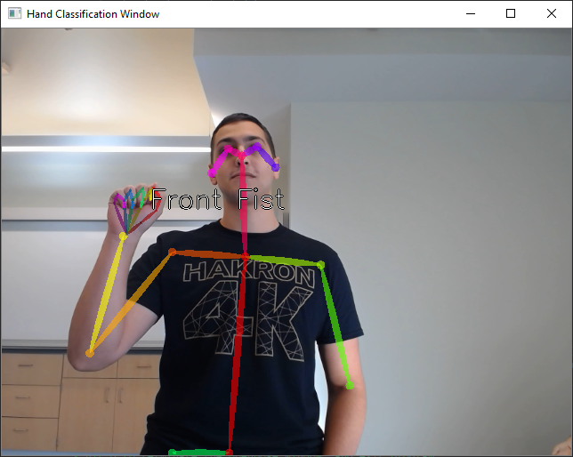
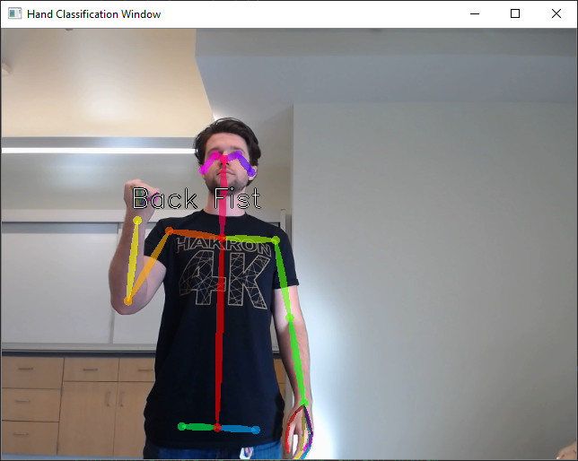
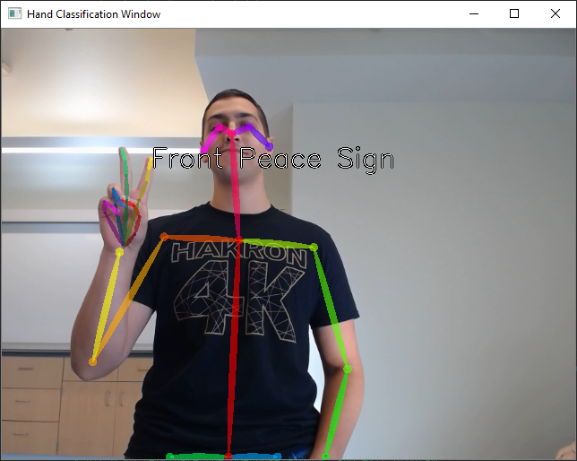
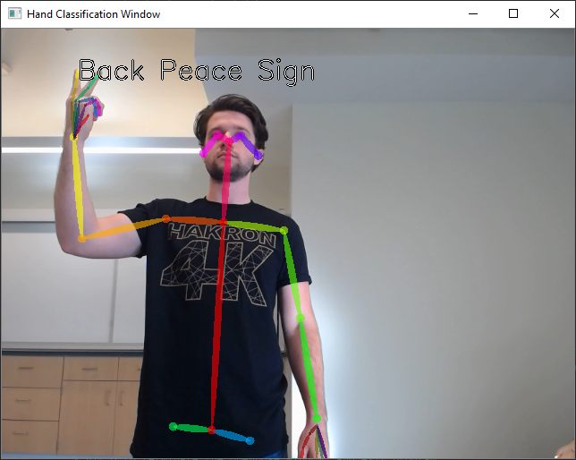
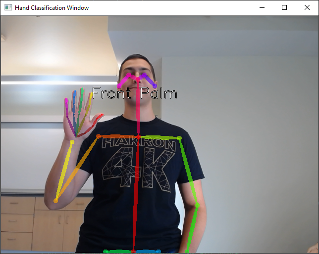
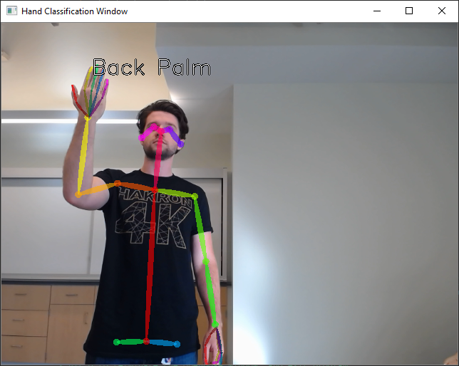
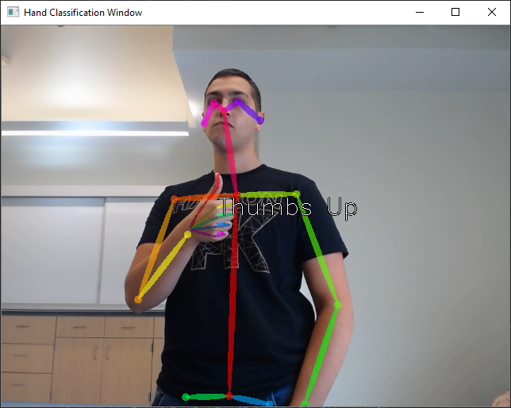
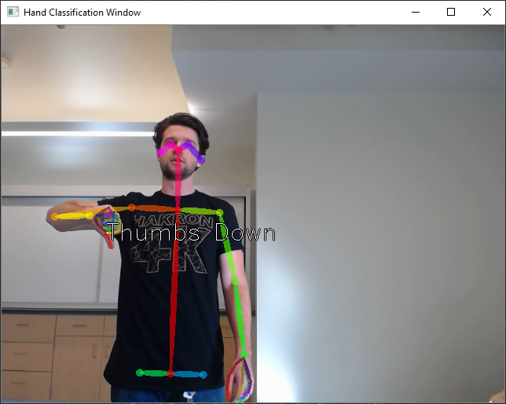
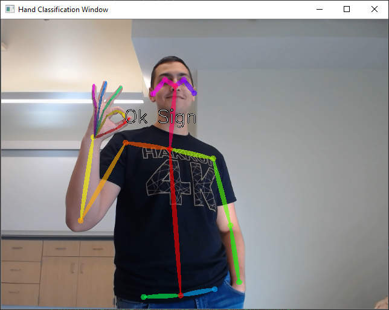
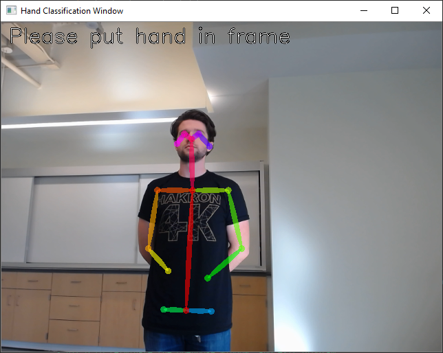

# Hand-Gesture-Recognition-with-Machine-Learning
A software project utilizing computer vision and machine learning techniques which can recognize 9 unique hand gestures. Created during HAkron's 24 hour hackathon, "HAkron 4k". Program made by [Michael Fasko Jr](https://github.com/Fasko) and [Jacob Calfee](https://github.com/jacobcalf/).

Project was awarded with "Best Software" and placed into the overall top 5 projects at HAkron 4k.

## Inspiration
Advancements in computer vision have allowed for body data keypoint recognition, being able to detect specific parts of a human's body by providing X and Y coordinates of those specific body parts. This advancement in computer vision can be used for various projects across many different disciplines.

By using this technology, we were interested in seeing the accuracy of being able to detect unique hand gestures, which can eventually lead to creating a system of being able to transcribe signed languages (e.g. American Sign language) into writing.

## What It Does
Recognizes 9 unique hand gestures: Front Fist, Back Fist, Front Peace, Back Peace, Front Palm, Back Palm, Thumbs Up, Thumbs Down, Ok Sign.

## What Did We Use
Programming Language: Python
Software Libraries: OpenPose, TensorFlow Keras, OpenCV, scikit-learn, numpy.

## How We Built It
 Firstly, built a dataset by recording our own hand gestures, combining for 9000 total labeled inputs (1000 per hand gesture).

Secondly, training a CNN by using TensorFlow Keras. 

Lastly, creating a demo application, which uses the trained model in order to predict a persons hand gestures.

# Images
Front Fist: &nbsp;

Back Fist: &nbsp;

Front Peace Sign: &nbsp;

Back Peace Sign: &nbsp;

Front Palm: &nbsp;

Back Palm: &nbsp;

Thumbs Up: &nbsp;

Thumbs Down: &nbsp;

Ok Sign: &nbsp;

No Hand Detected: &nbsp;

